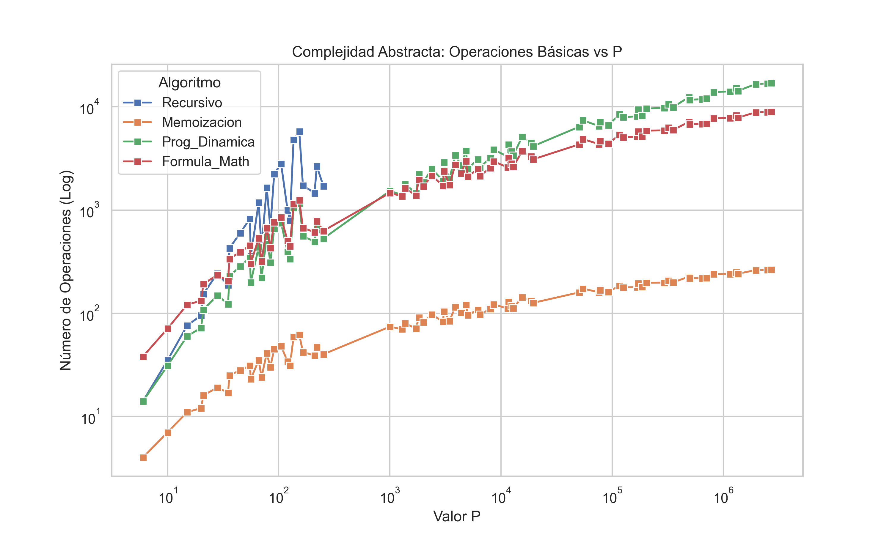

# Análisis de Complejidad: El Camino del Agente Secreto

**Asignatura:** Análisis y Diseño de Algoritmos  
**Tecnología:** Python 3.12 + Pytest + Matplotlib

## ✒️ Autores
Andrea Castro García

Mariana Romero Medina

## 📋 Descripción
Este proyecto resuelve el problema inverso de los coeficientes binomiales: dado un número de caminos $P$, encontrar las coordenadas $(m, n)$ en una rejilla.

El objetivo principal es comparar experimentalmente cuatro enfoques algorítmicos:
1. **Recursividad Pura:** $O(2^{m+n})$ - (Exponencial)
2. **Memoización:** $O(mn)$ - (Polinomial con alto consumo de memoria)
3. **Programación Dinámica:** $O(mn)$ - (Polinomial eficiente)
4. **Fórmula Matemática:** $O(1)$ - (Constante/Óptimo)

## 📊 Resultados Clave
Se demostró que el enfoque matemático reduce el tiempo de ejecución de segundos (o años en casos teóricos recursivos) a microsegundos.



## 🚀 Cómo ejecutar
1. Clonar el repositorio.
2. Ejecutar el experimento:
   ```bash
   python experimento.py
## Generar estadísticas y gráficas
   ```bash
   python resultados_estadisticos.py
   python graficas.py

